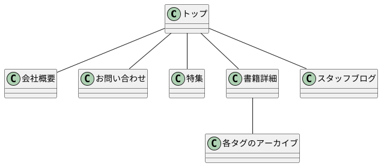

# サイト設計

## ペルソナ
| 項目 | 内容 | 理由（あれば） |
| :-- | :-- | :-- |
| 顔写真 |  |  |
| 人物像を表すコピー | 色んなジャンルの本が好き | 書評サイトなどをよく見て、自分の知らないジャンルの本を探したいと思っている人がターゲットのため |
| 名前 | 石田 雄二 |  |
| 年齢 | 30代 |  |
| 性別 | 男 |  |
| 住所（地理的環境） | 東京都内 | 来店できる範囲 |
| 職業 | - |  |
| 家族構成（既婚未婚や子どもの有無） | 独身 |  |
| 年収（世帯年収） | - |  |
| 趣味嗜好 | 読書 |  |
| よく利用するデバイス | - |  |
| インターネット利用暦やリテラシー | 新しい本の情報収集する程度 |  |
| よく利用しているWebサイト（好きなWebサイト） | https://allreviews.jp/ https://honz.jp/ https://book.asahi.com/reviews/ |  |

## SEOキーワード
- 本 特集
- 本 面白い
- 本 おすすめ
- 本 話題
- 本 イベント

## ユーザーシナリオ
石田 雄二は本が好きで、いつも面白い本がないか探している。
ただ、自分で選ぶとどうしても同じようなジャンルになってしまうのが悩みの種だ。
今までは本屋の特集コーナーなどにふらっと立ち寄って、手に取ったことのない本を探したりもしていたが、
最近はコロナの影響でそう気軽に本屋をぶらぶらできない。

検索エンジンで「本 特集」「本 おすすめ」というキーワードで検索し、当サイトの該当ページに到達。
普段読まない「自然科学」の本の特集があったため、興味をもって記事を読む。

記事で紹介されていた一冊に興味を持ち、購入を決める。
会社帰りに5分ほど店舗に立ち寄って購入。

週末に読んでみると期待以上の内容に満足。
翌日、Facebookで、当社ページのURLをコメントつきで紹介してくれました。

またその後、定期的に新着の特集記事がないかサイトに訪れてくれるようになりました。

## シナリオから考えられる課題
- 検索エンジンで上記のキーワードで検索したときに、一定以上の順位で表示される
- Facebook向けの適切なOGP設定
- Facebookから訪問に対する「いいね！」ボタンの提示
- 特集ページとそこに紐づく書籍紹介ページが必要
- 記事を読み終えた時に、店舗への来店を促せるよう。店舗限定の特集や地図情報を記載

## シナリオからの導線設計
- 検索エンジン
- 特集ページ
- 書籍詳細
- 地図ブックマーク
- （来店）
- （購入）
- （読む）
- （Facebook）
- 定期的な特集記事の掲載
- 新着記事の情報入手（RSS、twitter、facebook）

## 必要なコンテンツ
- トップページ（新着書籍・特集へのリンクを掲載、検索機能）
- 会社概要ページ（特に地図・営業時間を分かりやすく、アクセスセクションにアンカーリンク張れるように）
- 特集ページ（特集によってデザインに柔軟性持たせたい）
- 書籍詳細ページ（タグによるジャンル分類、アーカイブページ）
- スタッフブログ（店頭限定特集・イベント告知）
- お問い合わせページ

## 動線設計

## スラッグ
| ページ名 | スラッグ |	URL | ページの種類 |
| :--- | :--- | :--- | :--- |
| トップ |  | http://siteurl.jp/ | 固定ページ |
| 会社概要 | about | http://siteurl.jp/about/ | 固定ページ |
| 特集 | about | http://siteurl.jp/special/xxxxx/ | 固定ページ |
| 書籍詳細 | book | http://siteurl.jp/book/yymmdd/ | 投稿ページ |
| スタッフブログ | staff | http://siteurl.jp/blog/yymmdd/ | 投稿ページ |
| お問い合わせ | contact | http://siteurl.jp/contact/ | 固定ページ |

## 使用するプラグイン
| プラグイン名 | 機能 | URL |
| :--- | :--- | :--- |
| Contact Form 7 | フォーム作成 | https://ja.wordpress.org/plugins/contact-form-7/ |
| Really Simple CAPTCHA | CAPTCHA機能 | https://ja.wordpress.org/plugins/really-simple-captcha/ |
| Duplicate Post | 作成済み投稿を複製できるようにする | https://ja.wordpress.org/plugins/duplicate-post/ |
| Related Posts for WordPress | 関連記事表示 | https://ja.wordpress.org/plugins/related-posts-for-wp/ |
| WordPress Popular Posts | 人気記事表示 | https://ja.wordpress.org/plugins/wordpress-popular-posts/ |
| Google XML Sitemaps | Googleに登録するXMLサイトマップを自動生成・更新 | https://ja.wordpress.org/plugins/google-sitemap-generator/ |
|  |  |  |
|  |  |  |
|  |  |  |
